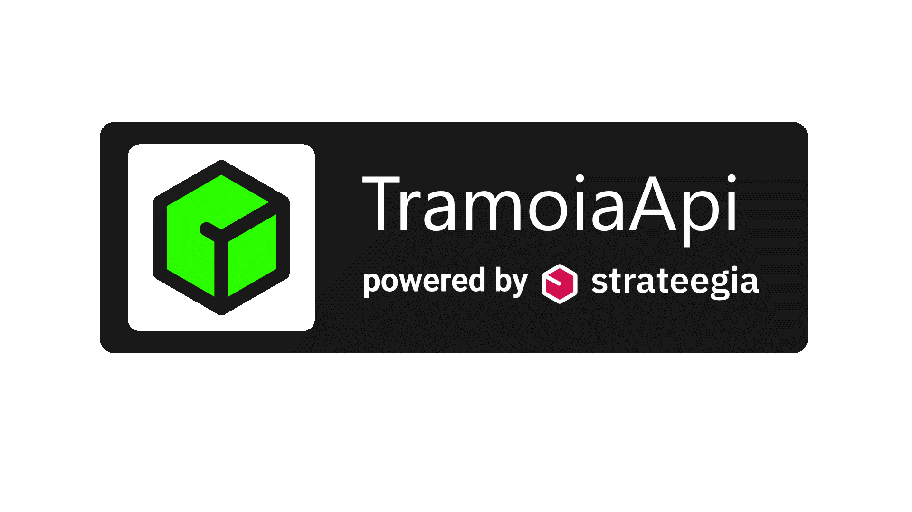

## Projeto didático-prático da disciplina (IF977) Engenharia de Software, do curso de graduação em Sistemas de Informação do Centro de Informática (CIn) da Universidade Federal de Pernambuco (UFPE) 2020.1

# Tramoia API
Esta API é a base do projeto Tramoia App.
O objetivo dessa API é servir de ponte entre os dados do strateegia.digital e o Tramoia App.

## Time
* Arlindo Maximiano
* Bruno Martins
* Gustavo Nogueira ( gn2@cin.ufpe.br )
* Haziel Farias
* Sidney Alex

## Nosso objetivo: 

Uma aplicação de monitoramento e observação dos projetos do Strateegia,
seria um dashboard que iria exibir em gráficos uma série de indicadores 
quantitativos de projetos como também buscar trazer mais indicadores qualitativos (ou próximos disso);

## Introdução do projeto:

Antes de falar sobre o Tramoia App é bom entender o strateegia.digital. Que é uma plataforma para habilitar e apoiar equipes e empresas que estão projetando artefatos de forma estratégica. É uma plataforma simples e vem evoluindo diariamente, e já é utilizada por mais de 1500 pessoas de 20 países em mais de 500 projetos, além de 20 times de clientes corporativos. 

O objetivo dessa API é servir de ponte entre os dados do strateegia.digital e o Tramoia App. Criando um dashboard, que no contexto de TI, é um painel visual que apresenta, de maneira centralizada, um conjunto de informações: indicadores e suas métricas. Essas informações podem ser tanto indicadores da área de TI como de gestão empresarial. Em ambos os casos, esse recurso auxilia na tomada de decisões. 

## Justificativa:

Nosso App tem a função de auxiliar os usuários do strateegia.digital na tomada de decisões. No mundo globalizado e tecnológico as empresas estão cada vez mais competitivas. É importante ressaltar o papel dos fatores Humanos tanto para o funcionamento da empresa em si, como para a relação com stakeholders e os colaboradores. Depreende-se, portanto, a necessidade de ferramentas que auxiliem na gestão de pessoas e tomada de decisão.

## Stack da API
* MongoDB
* Node

## Bibliotecas Utilizadas
* axios
* espress
* dotenv
* mongoose
* body-parser
* cors
* nodemon

### Rodando localmente
* git clone https://github.com/silvercent011/TramoiaAPI.git
* npm start

